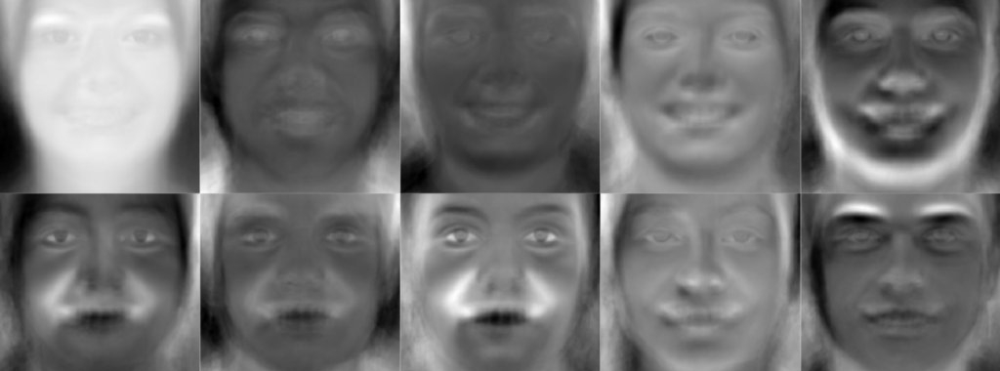
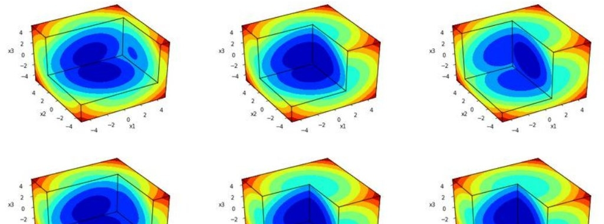
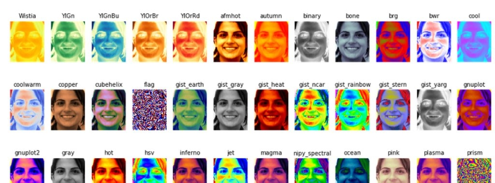

### [Visualizing PCA on Face Images](https://nbviewer.jupyter.org/github/ddfabbro/ipython_tutorial/blob/master/my_notebooks/faces_data_analysis.ipynb)

The initial purpose of this tutorial was to introduce my colleague, whos a college sophomore in Engineering, an intuitive feeling for Dimensionality Reduction techniques and how to visualize it. I could choose the well-known iris dataset to do this, but I decided to work with data belonging to a much higher feature space - images. 75000 dimensions to be exact. [Read more](https://nbviewer.jupyter.org/github/ddfabbro/ipython_tutorial/blob/master/my_notebooks/faces_data_analysis.ipynb)

### [Plotting 3D Search Spaces](https://nbviewer.jupyter.org/github/ddfabbro/ipython_tutorial/blob/master/my_notebooks/plot3d_seach_space.ipynb)

As I was making progress on my Master's thesis, I needed to figure a way to show visualizations of functions with 3 variables, so I created a Python script that allows me to visualize it using contour surfaces. This is a tutorial showing how I implemented this Python script and how it helped me gain insights about a function that would otherwise be extremely hard to visualize. [Read more](https://nbviewer.jupyter.org/github/ddfabbro/ipython_tutorial/blob/master/my_notebooks/plot3d_seach_space.ipynb)

### [Color Map Effects on Face Images](https://nbviewer.jupyter.org/github/ddfabbro/ipython_tutorial/blob/master/my_notebooks/colormap_effects.ipynb)

As soon as you get some data, you may want to create a plot and see what it looks like. You may even want to share your findings with your colleagues in a way that is easiest for them to understand. For these reasons, you will eventually need to choose the colors for you plot in order to summarize some information. A pre defined set of colors is called a color map, or cmap for short. [Read more](https://nbviewer.jupyter.org/github/ddfabbro/ipython_tutorial/blob/master/my_notebooks/colormap_effects.ipynb)
